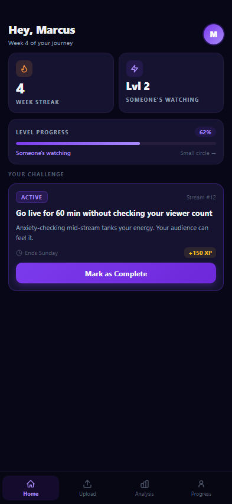
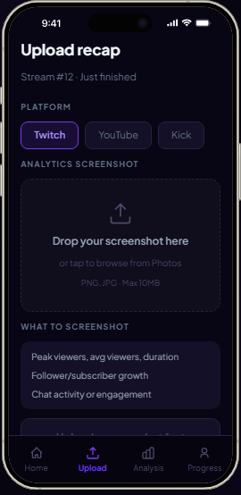
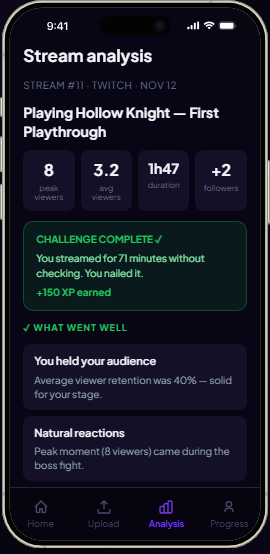
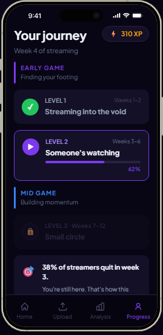

<div align="center">

# StreamLoop

**The coaching app for beginner streamers**

[streamloop.org](https://streamloop.org)&nbsp;&nbsp;·&nbsp;&nbsp;[](https://streamloop.org)&nbsp;&nbsp;[](#)

</div>

---

## The problem

Most beginner streamers quit within the first month — not because they lack talent, but because they don't know what to work on. They go live, get 3 viewers, feel lost, and stop.

The gap isn't talent. It's guidance.

## What StreamLoop does

StreamLoop identifies your specific weak spot as a streamer:

- *"I'm comfortable talking but my tech setup is a mess"*
- *"My setup is fine but I have no idea what to say on stream"*
- *"I can do everything but I'm terrified to actually go live"*

Then it gives you a loop of small, targeted tasks matched to your situation.

```
assess weak spots → get task → stream → report back → get better task → repeat
```

The core belief: popular streamers weren't born that way. They learned. StreamLoop is how you learn faster.

---

## Screens

<div align="center">

&nbsp;
&nbsp;
&nbsp;


*Home · Upload · Analysis · Progress*

</div>

---

## Roadmap

- [x] Concept & MVP design
- [ ] Onboarding assessment flow
- [ ] Task engine with personalized recommendations
- [ ] Stream report submission (manual + screenshot)
- [ ] AI-powered progress analysis
- [ ] Platform API integrations (Twitch, YouTube, Kick)
- [ ] Live stream companion bot

## Stack

Flutter · FastAPI · PostgreSQL · OpenAI

---

<div align="center">

*Want to follow along or collaborate? →* [streamloop.org](https://streamloop.org)

</div>
